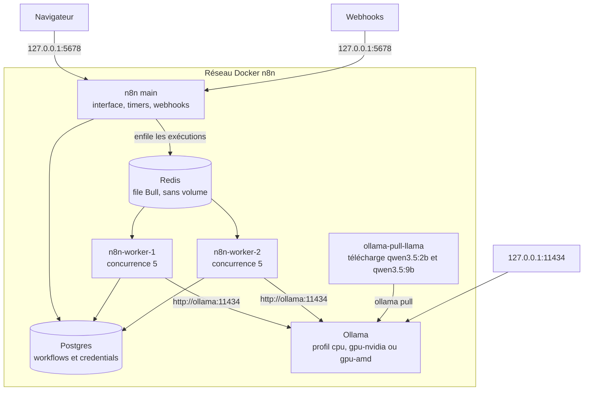

# n8n-self-host-ai

## Architecture



Postgres et Redis restent internes au réseau. Un seul profil Ollama tourne à la fois. `ollama-pull-llama` s’arrête une fois `qwen3.5:2b` et `qwen3.5:9b` téléchargés.

Stack Docker Compose pour un n8n self-hosted en [queue mode](https://docs.n8n.io/deploy/host-n8n/configure-n8n/scaling/enable-queue-mode), avec Postgres, Redis et Ollama. Les modèles tournent dans Docker. Le premier démarrage télécharge `qwen3.5:2b` et `qwen3.5:9b`.

Le main sert l’interface, les timers et les webhooks. Il enfile les exécutions dans Redis. Deux workers (concurrence 5 chacun) les exécutent, y compris les tests lancés depuis l’éditeur. Postgres garde les workflows et les credentials. Redis n’a pas de volume : la file repart de zéro à chaque redémarrage.

## Prérequis

- Docker Compose v2 et un Docker Engine récent. Les images `latest` de 2026 utilisent des couches compressées en zstd. Docker Desktop 4.16 (Engine 20.10) ne sait pas les extraire et échoue avec `archive/tar: invalid tar header`.
- Pour `--profile gpu-nvidia` : [NVIDIA Container Toolkit](https://docs.nvidia.com/datacenter/cloud-native/container-toolkit/latest/install-guide.html)
- Pour `--profile gpu-amd` : appareils `/dev/kfd` et `/dev/dri` accessibles par Docker

Sur Mac, le GPU n’est pas exposé à Docker. Utiliser `--profile cpu`.

## Démarrage

```bash
cp .env.example .env
```

Remplacer dans `.env` les valeurs `change-me` : mot de passe Postgres, mot de passe Redis, clé de chiffrement n8n et secret JWT. La même clé de chiffrement doit rester en place pour tous les processus n8n, sinon les credentials déjà enregistrés deviennent illisibles.

CPU :

```bash
docker compose --profile cpu up
```

GPU Nvidia :

```bash
docker compose --profile gpu-nvidia up
```

GPU AMD :

```bash
docker compose --profile gpu-amd up
```

Un seul profil à la fois : les trois variantes Ollama portent le même nom de conteneur.

## Accès

- n8n : http://localhost:5678/
- Ollama : http://127.0.0.1:11434/

Postgres et Redis ne sont pas publiés sur la machine. Ils restent sur le réseau Docker.

Au premier lancement, le conteneur `ollama-pull-llama` télécharge `qwen3.5:2b` puis `qwen3.5:9b`. L’interface n8n peut être prête avant la fin du téléchargement. Suivre la progression avec `docker compose logs -f ollama-pull-llama-cpu` (ou `ollama-pull-llama-gpu` / `ollama-pull-llama-gpu-amd` selon le profil).

Dans un workflow, le nœud Ollama joint le service à l’adresse `http://ollama:11434`.

## Notes

Les nœuds Code utilisent le task runner interne, dans le même conteneur que n8n. n8n peut afficher un avertissement de dépréciation : c’est attendu pour ce POC.

Les fichiers manipulés par les workflows restent en mémoire. Ce stack ne configure pas de stockage binaire partagé, que le queue mode ne prend pas en charge sur un filesystem.
